# API Workflows

## User Registration
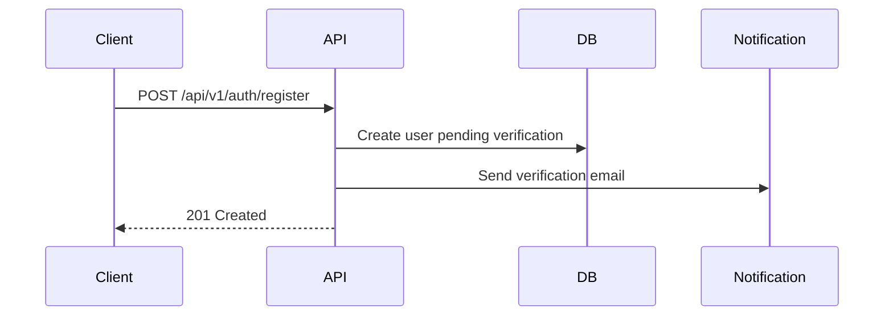

## User Login
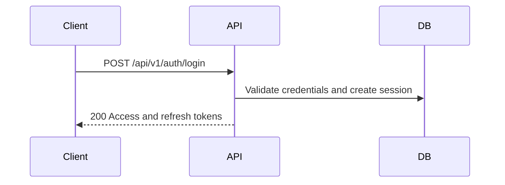

## Queue Creation
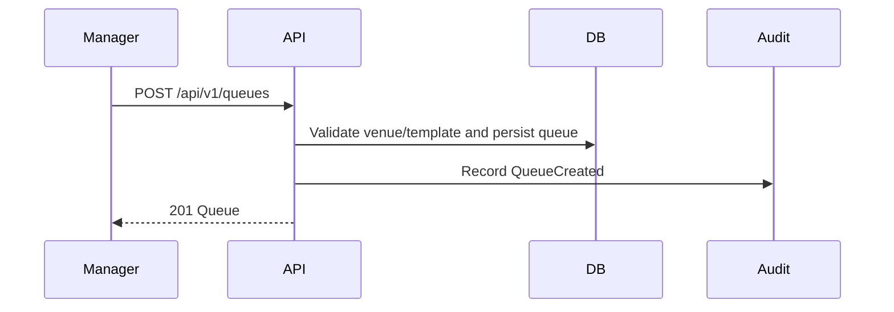

## Join Queue
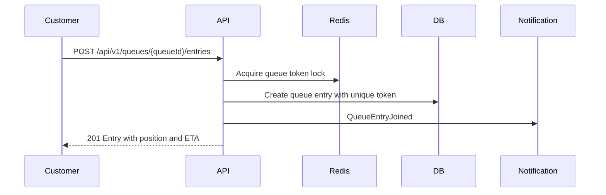

## Leave Queue
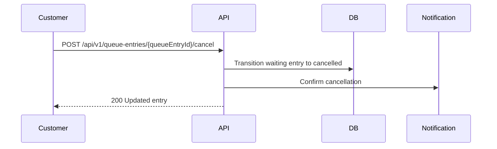

## Call Next Customer
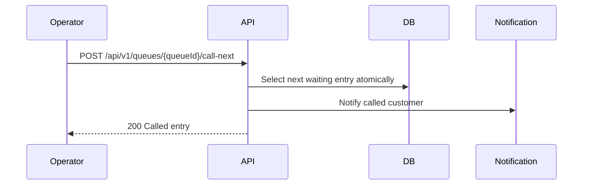

## Serve Customer
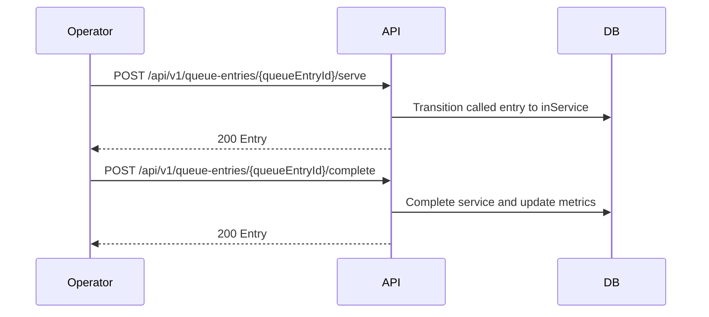

## Notification Delivery
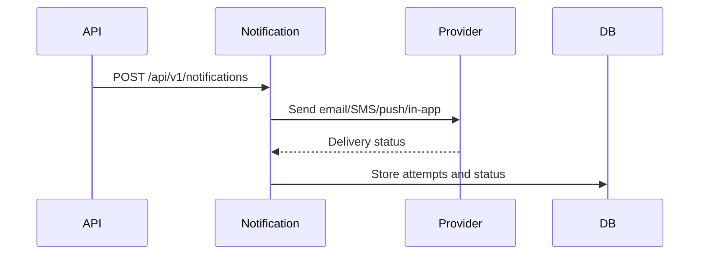

## Password Reset
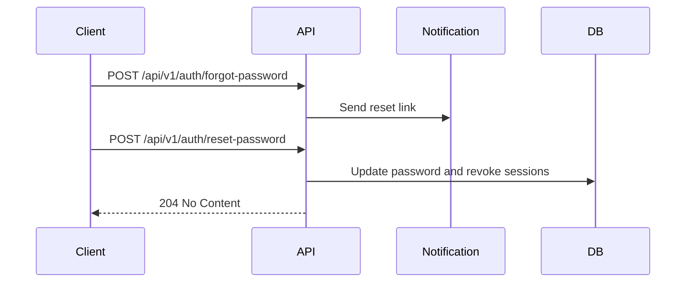

## Token Refresh
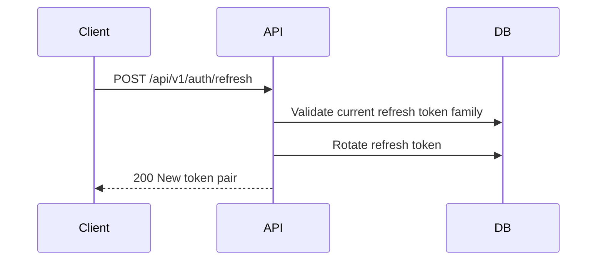

## Analytics Generation
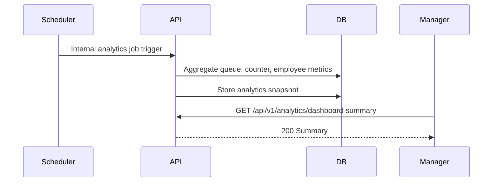
