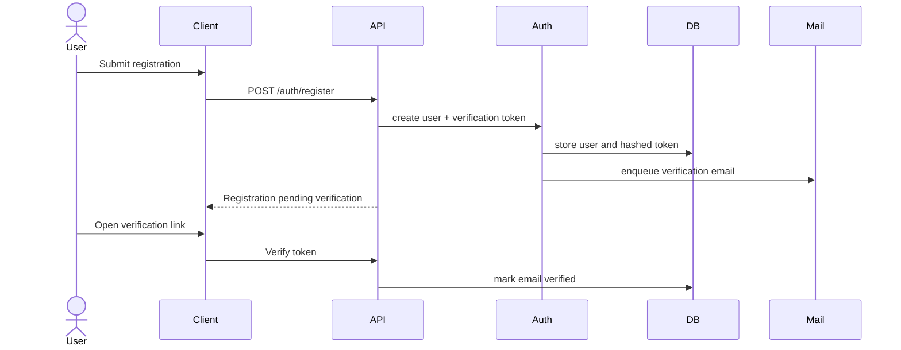
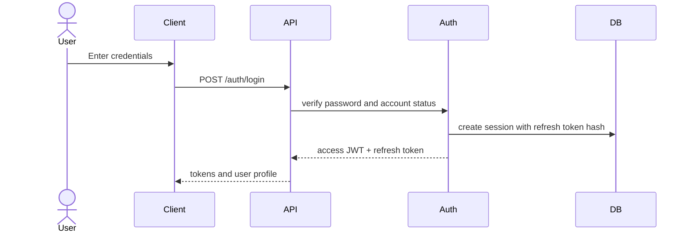
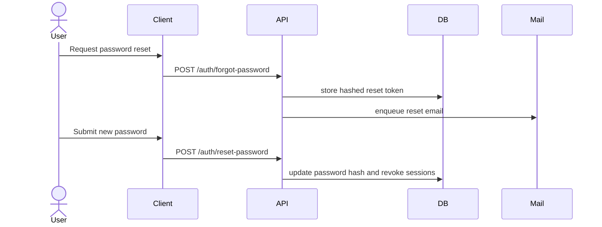

# Authentication Architecture

Authentication uses short-lived JWT access tokens and rotating refresh tokens stored server-side as hashes.

## Registration and Email Verification

## Login, JWT, and Refresh Tokens

## Password Reset

## RBAC

Roles include `customer`, `staff`, `branch_manager`, `organization_admin`, and `platform_admin`. Permissions are evaluated in the application layer using tenant context, role assignments, and resource ownership.

## Session and Token Policy

- Access token lifetime: 5-15 minutes.
- Refresh token lifetime: 7-30 days based on risk profile.
- Refresh token rotation on every refresh.
- Reuse detection revokes the token family.
- Session metadata records device, IP hash, user agent, expiration, and revocation.

## Security Considerations

Passwords are hashed with Argon2id or bcrypt with strong cost settings. Verification and reset tokens are single-use, hashed at rest, time-limited, and rate-limited. JWTs include issuer, audience, subject, tenant, roles, expiration, and token ID.

## Decision Analysis

| Aspect | Detail |
| --- | --- |
| Why chosen | JWTs scale API authorization while server-side refresh sessions preserve revocation control. |
| Alternatives considered | Cookie-only server sessions, opaque bearer tokens, third-party-only identity. |
| Advantages | Stateless access checks, revocable long-lived sessions, good SPA compatibility. |
| Disadvantages | Token theft risk and more complex rotation logic. |
| Future impact | Can integrate SSO/OIDC by mapping external identities to internal users and sessions. |
