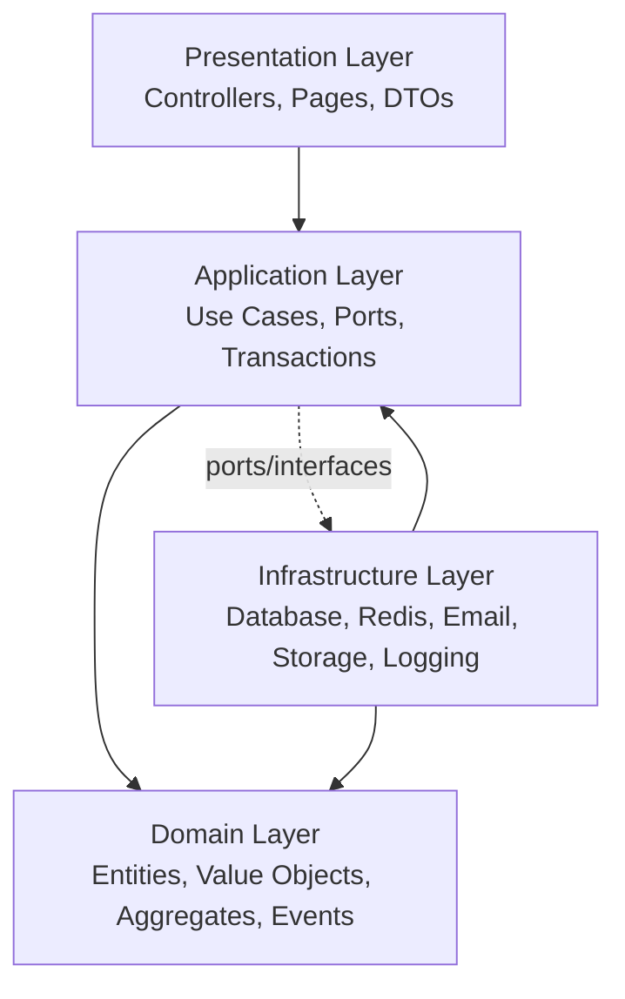

# Clean Architecture

QueueIt is organized around Clean Architecture to keep business rules independent from frameworks, databases, and delivery mechanisms.

## Dependency Rule

Dependencies point inward. Outer layers may depend on inner layers, but the domain layer must not depend on application, infrastructure, or presentation concerns.

## Layers

### Presentation

Responsibilities: HTTP routing, request/response DTOs, validation boundary, authentication guards, frontend pages, and client-side state. It must not contain domain decisions.

### Application

Responsibilities: use-case orchestration, transaction boundaries, authorization checks, calling repositories through ports, publishing domain events, and mapping domain failures to application errors.

### Domain

Responsibilities: queue lifecycle rules, aggregate invariants, value-object validation, domain services, and domain events. This is the most stable layer.

### Infrastructure

Responsibilities: PostgreSQL repositories, Redis cache/locks, email/SMS provider adapters, object storage, job queue, logging, and monitoring integrations.

## Decision Analysis

| Aspect | Detail |
| --- | --- |
| Why chosen | Clean Architecture isolates core queue logic from implementation choices and improves testability. |
| Alternatives considered | MVC-only layering, transaction-script architecture, microservice-first decomposition. |
| Advantages | High maintainability, easy adapter replacement, domain-focused tests. |
| Disadvantages | More upfront structure and abstractions than a simple CRUD app. |
| Future impact | Enables extracting bounded contexts or replacing delivery/storage technology with less risk. |
