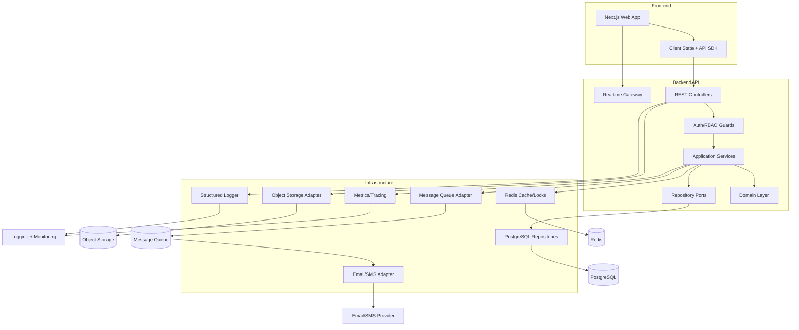

# Component Diagram

## Decision Analysis

| Aspect | Detail |
| --- | --- |
| Why chosen | Components align runtime dependencies with Clean Architecture modules. |
| Alternatives considered | Direct controller-to-database access, frontend direct database access, all side effects inline. |
| Advantages | Testable boundaries, asynchronous resilience, centralized observability. |
| Disadvantages | More moving parts than a minimal CRUD application. |
| Future impact | Message and repository adapters can be replaced without changing domain rules. |
