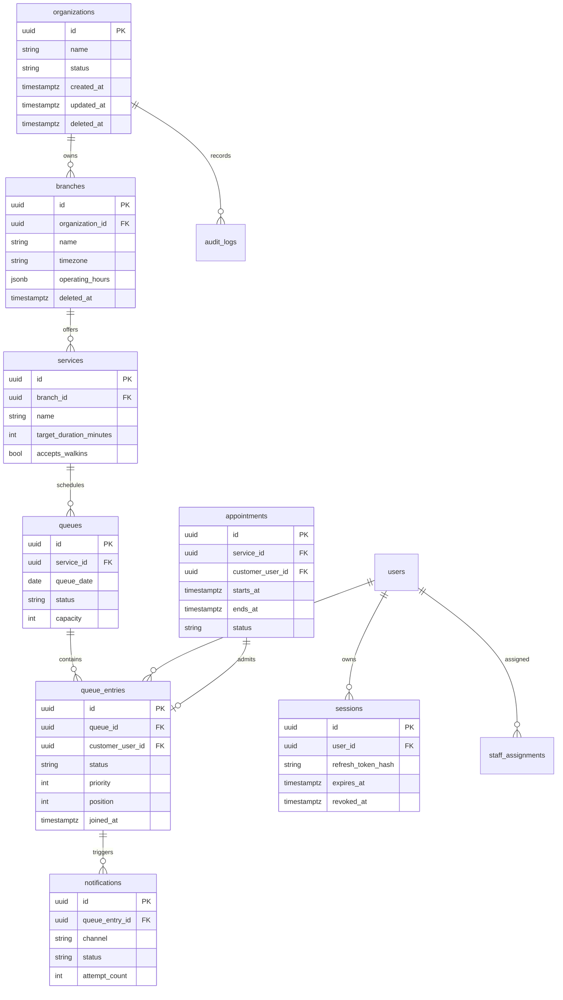

# Database Architecture

PostgreSQL is the durable system of record. Redis is not authoritative and may be rebuilt from PostgreSQL.

## ER Diagram

## Tables and Constraints

- Primary keys use UUIDs.
- Foreign keys enforce tenant and lifecycle relationships.
- Check constraints restrict enum-like status values.
- Unique constraints prevent duplicate active queue entries per customer/service when policy requires.
- Partial unique indexes enforce only one active queue per service/date.
- Optimistic `version` columns protect concurrent updates.

## Indexes

| Table | Index | Purpose |
| --- | --- | --- |
| `queue_entries` | `(queue_id, status, priority DESC, position ASC)` | Fast call-next selection. |
| `queue_entries` | `(customer_user_id, status)` | Customer active queue lookup. |
| `queues` | `(service_id, queue_date)` unique active partial | Locate current queue. |
| `sessions` | `(user_id, expires_at)` | Session management. |
| `notifications` | `(status, next_attempt_at)` | Worker polling. |
| `audit_logs` | `(organization_id, created_at DESC)` | Admin audit views. |

## Soft Delete and Audit Fields

Most business tables include `created_at`, `created_by`, `updated_at`, `updated_by`, `deleted_at`, and `deleted_by`. Soft delete preserves auditability and prevents losing historical queue metrics. Hard delete is reserved for short-lived tokens and legally required data-erasure workflows.

## UUID Strategy

Use UUIDv7 for sortable identifiers where supported, otherwise UUIDv4. UUIDs avoid leaking row counts, simplify distributed creation, and reduce coupling to database sequences.

## Migration Strategy

Use versioned migrations run by CI/CD before application rollout. Backward-compatible migrations are preferred: expand schema, deploy code, backfill, then contract schema.

## Decision Analysis

| Aspect | Detail |
| --- | --- |
| Why chosen | QueueIt needs relational integrity, transactions, reporting, and predictable query behavior. |
| Alternatives considered | MongoDB, DynamoDB, MySQL. |
| Advantages | ACID transactions, mature indexing, JSONB flexibility, strong ecosystem. |
| Disadvantages | Horizontal write scaling is harder than some NoSQL systems. |
| Future impact | Read replicas and partitioning can scale analytics and historical queue data. |
