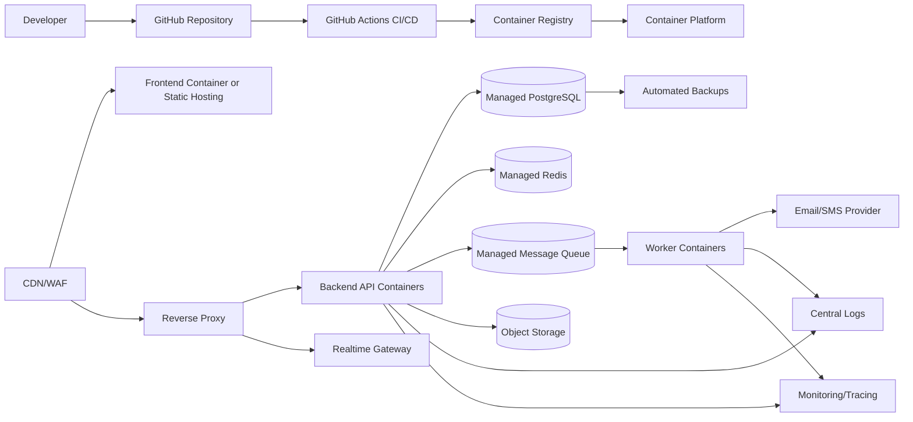

# Deployment Architecture

QueueIt production deployment uses containers behind a reverse proxy, managed PostgreSQL, managed Redis, object storage, CDN, centralized logging, monitoring, and automated CI/CD.

## Deployment Diagram

## Production Elements

- **Frontend:** Deployed to CDN-backed hosting or container platform.
- **Backend:** Horizontally scalable API containers.
- **Database:** Managed PostgreSQL with point-in-time recovery.
- **Redis:** Managed Redis for cache, rate limits, and locks.
- **Reverse proxy:** TLS termination, routing, compression, request limits.
- **CDN/WAF:** Static asset acceleration and edge protection.
- **Docker:** Immutable runtime artifact for API and workers.
- **Container registry:** Stores versioned images.
- **CI/CD:** Lint, test, build, scan, migrate, deploy, and rollback.
- **Cloud provider:** AWS preferred baseline; Azure is viable alternative.
- **Monitoring/logging:** Metrics, traces, structured logs, alerts.
- **Backups:** Daily snapshots, PITR, restore tests.
- **Disaster recovery:** Infrastructure-as-code rebuilds, documented RTO/RPO, cross-region backup copies.

## Decision Analysis

| Aspect | Detail |
| --- | --- |
| Why chosen | Containers provide portable deployments and predictable scaling without binding the design to one runtime. |
| Alternatives considered | Bare VMs, serverless-only, PaaS-only. |
| Advantages | Repeatable builds, horizontal scaling, clear separation of API and workers. |
| Disadvantages | Requires container orchestration and operational maturity. |
| Future impact | Kubernetes or ECS can support zero-downtime deploys and service extraction. |
