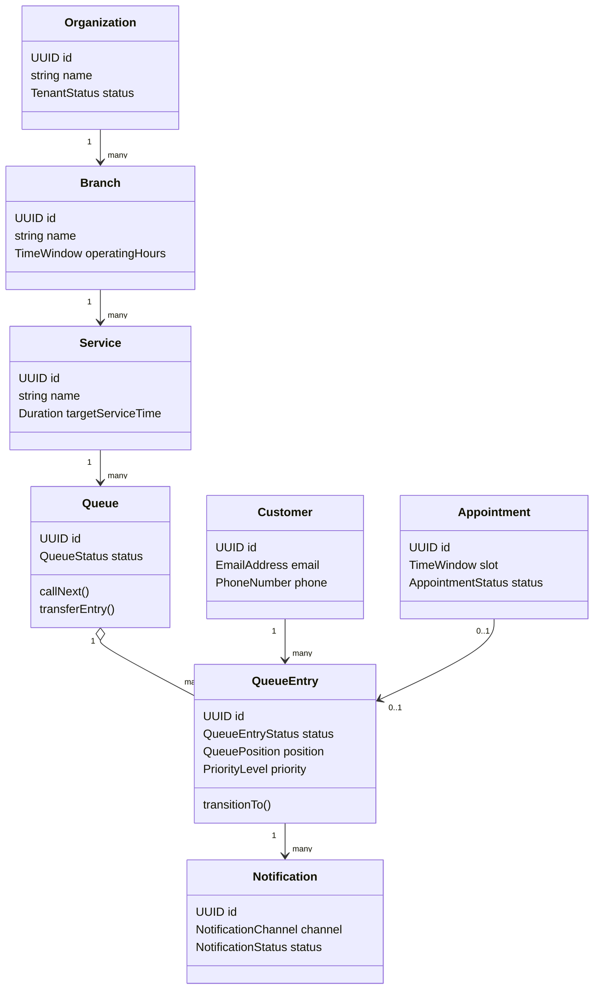

# Domain Model

The QueueIt domain centers on organizations operating branches that expose services, each service having one or more queues containing queue entries for customers.

## Core Concepts

### Entities

- `Organization`: tenant boundary and billing/administration owner.
- `Branch`: physical or virtual location where queues operate.
- `Service`: type of service customers request.
- `Queue`: operational queue for a branch/service/date.
- `QueueEntry`: customer position and lifecycle in a queue.
- `User`: authenticated actor.
- `StaffMember`: user assigned to serve queues.
- `Appointment`: scheduled customer arrival.
- `Notification`: delivery record.

### Value Objects

- `EmailAddress`, `PhoneNumber`, `QueuePosition`, `TimeWindow`, `EstimatedWaitTime`, `PriorityLevel`, `TokenId`, `Money`, `Locale`.

### Aggregates

- `Organization` aggregate owns branches and organization policy references.
- `Queue` aggregate owns queue entries and enforces queue state transitions.
- `User` aggregate owns credentials, sessions, and verification state.
- `Notification` aggregate tracks delivery attempts and provider status.

### Repositories

- `OrganizationRepository`, `QueueRepository`, `QueueEntryRepository`, `UserRepository`, `SessionRepository`, `AppointmentRepository`, `NotificationRepository`.

### Domain Services

- `QueueRankingService`: calculates priority-aware order.
- `EstimatedWaitTimeService`: estimates waits from service time history.
- `QueueTransitionPolicy`: validates legal transitions.
- `AppointmentAdmissionService`: admits appointments into live queues.

### Domain Events

- `QueueEntryJoined`, `QueueEntryCalled`, `QueueEntryServingStarted`, `QueueEntryCompleted`, `QueueEntryCancelled`, `QueueEntryNoShow`, `QueueEntryTransferred`, `QueueStatusChanged`, `NotificationRequested`, `UserRegistered`, `PasswordResetRequested`.

## Class Diagram

## Decision Analysis

| Aspect | Detail |
| --- | --- |
| Why chosen | The queue aggregate protects the highest-risk invariant: one consistent order and lifecycle per queue. |
| Alternatives considered | Anemic CRUD records, customer-centric aggregate, one aggregate per queue entry only. |
| Advantages | Explicit rules, controlled transitions, event-driven side effects. |
| Disadvantages | Hot queues may create aggregate contention and require careful locking. |
| Future impact | Queue operations can later become a dedicated service with the aggregate model intact. |
