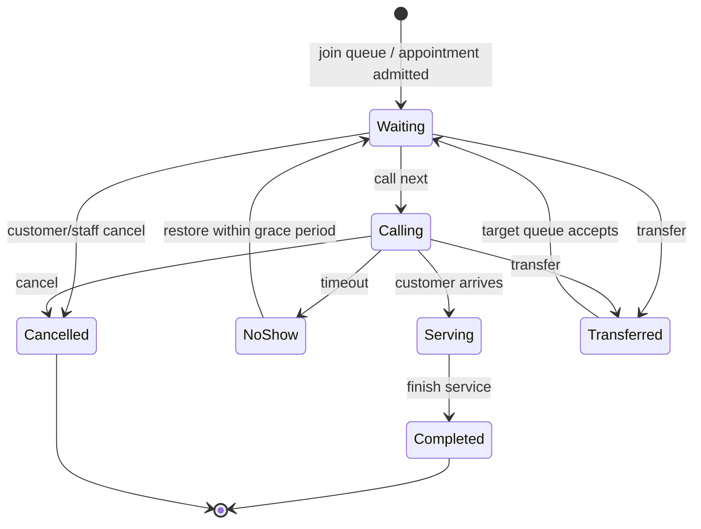
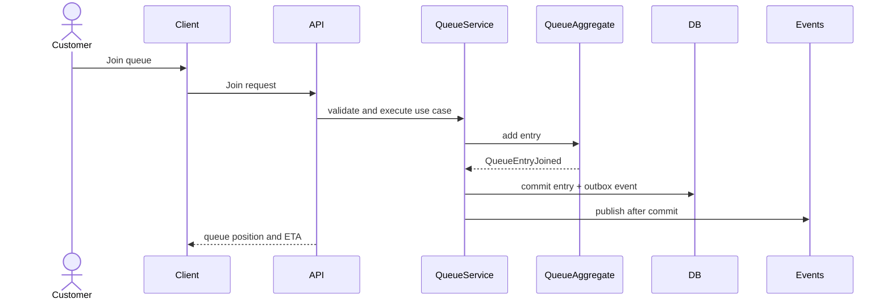

# Queue Lifecycle

Queue entries move through a controlled state machine. Invalid transitions are rejected by the domain layer.

## States

- `Waiting`: customer is in line.
- `Calling`: staff has called the customer.
- `Serving`: staff is actively serving the customer.
- `Completed`: service finished.
- `Cancelled`: customer or staff cancelled.
- `NoShow`: customer did not respond within the call window.
- `Transferred`: entry moved to another queue.

## State Diagram

## Join Queue Sequence

## Priority, Walk-ins, and Appointments

Priority queues use `PriorityLevel` plus join time to preserve fairness within each priority band. Walk-ins create entries immediately if capacity and operating-hour policies allow. Appointments reserve a time window and are admitted to the live queue near arrival time according to branch policy.

## Failure Scenarios and Retry Strategy

| Scenario | Handling |
| --- | --- |
| Duplicate join request | Idempotency key prevents duplicate active entries. |
| Call-next race | Transactional lock or Redis lock plus database verification. |
| Notification provider failure | Retry with exponential backoff and dead-letter queue. |
| Client disconnect | Queue state remains durable; client resyncs from API. |
| Worker crash | Outbox event remains pending and is retried. |
| Transfer target unavailable | Reject transition or keep original entry unchanged. |

## Decision Analysis

| Aspect | Detail |
| --- | --- |
| Why chosen | Explicit states prevent ambiguous queue behavior and simplify testing. |
| Alternatives considered | Free-form status updates, event sourcing from day one. |
| Advantages | Predictable operations, clear audit trail, easy UI status mapping. |
| Disadvantages | New operational cases require deliberate transition design. |
| Future impact | The state machine can later be backed by workflow tooling or event sourcing if needed. |
