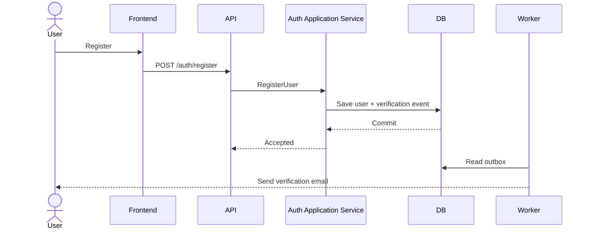
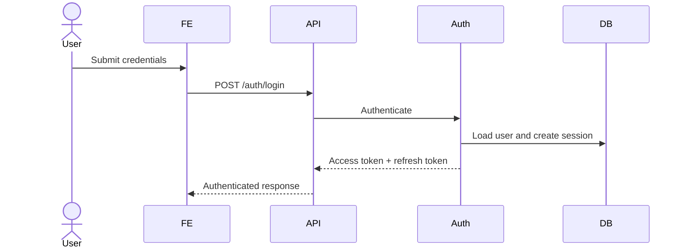
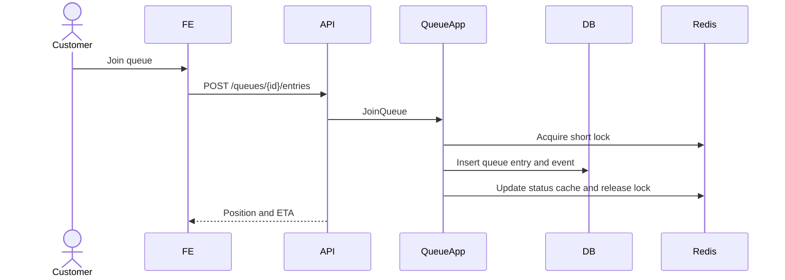
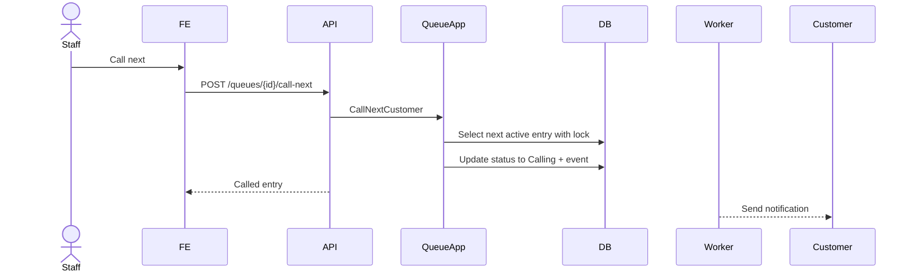
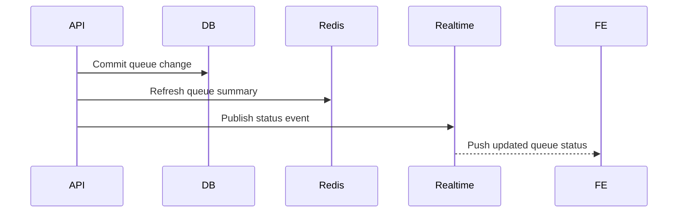
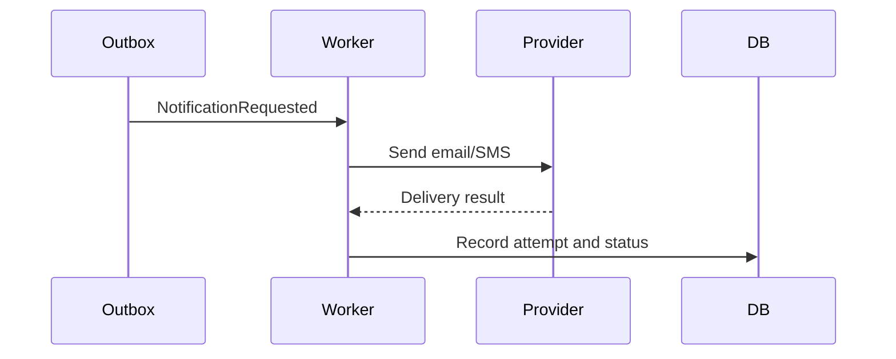
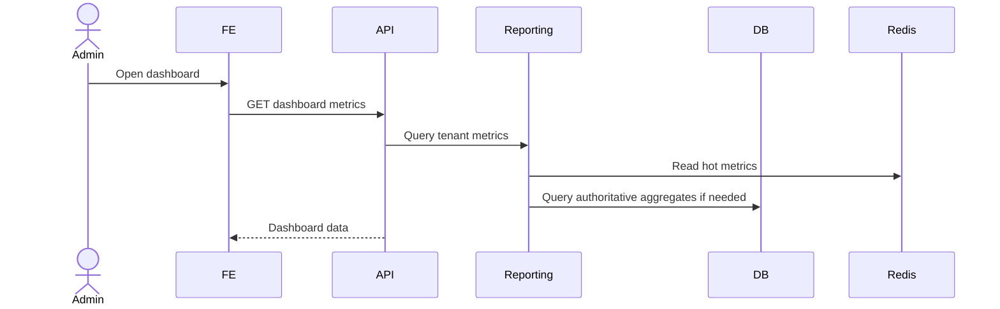
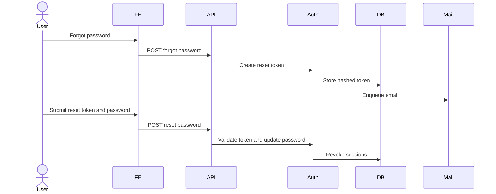
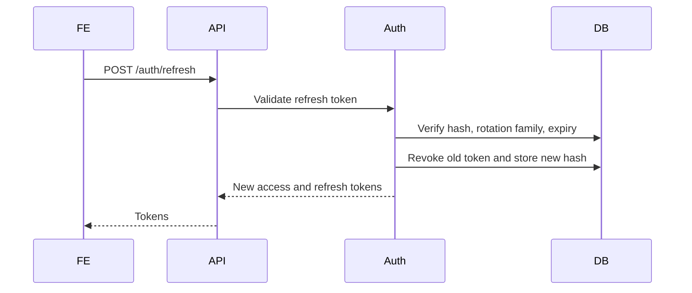

# Sequence Diagrams

## User Registration

## User Login

## Join Queue

## Call Next Customer

## Queue Status Update

## Notification

## Admin Dashboard

## Password Reset

## Token Refresh

