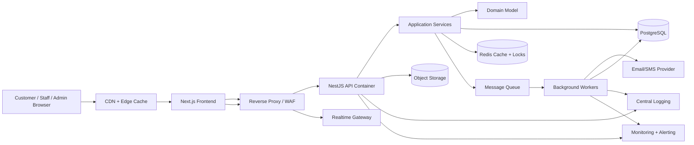

# High-Level System Architecture

QueueIt uses a modular cloud-ready web architecture: a browser-based client communicates with a backend API, the API coordinates application use cases, domain rules protect queue invariants, PostgreSQL stores durable state, Redis supports low-latency coordination, and asynchronous workers deliver notifications and background jobs.

## Architecture Style

The chosen style is a **modular monolith with Clean Architecture boundaries** deployed as containers.

| Decision | Explanation |
| --- | --- |
| Why chosen | QueueIt needs strong consistency around queue state, fast initial delivery, and clear module boundaries without early distributed-system complexity. |
| Alternatives considered | Microservices, serverless functions, traditional layered MVC. |
| Advantages | Simpler transactions, fewer deployment units, easier debugging, clear path to extract modules later. |
| Disadvantages | Requires discipline to avoid module coupling; one deployable can become large. |
| Future impact | Bounded contexts such as Notifications, Identity, and Queue Operations can be extracted into services when load or team structure requires it. |

## Major Building Blocks

- **Client:** Next.js web application for customers, staff, and administrators.
- **Server:** NestJS backend API exposing REST endpoints and real-time status channels.
- **Database:** PostgreSQL as the primary source of truth.
- **Authentication:** JWT access tokens, rotating refresh tokens, email verification, password reset, and RBAC.
- **External services:** Email/SMS providers, object storage, payment/identity integrations if required later.
- **Notification service:** Background workers consume events and deliver email, SMS, push, or in-app notifications.
- **File storage:** Cloud object storage for organization logos, documents, and exported reports.
- **Logging:** Structured JSON logs with correlation IDs.
- **Monitoring:** Metrics, traces, uptime checks, alerts, and business KPIs such as wait time and no-show rate.

## Architecture Diagram

## Component Relationships

1. The frontend owns rendering, routing, forms, and API consumption.
2. The API validates requests, authenticates users, and invokes application use cases.
3. Application services orchestrate transactions, repositories, domain services, and event publishing.
4. Domain objects enforce queue rules such as legal state transitions and capacity constraints.
5. Infrastructure adapters implement persistence, cache, file storage, email, logging, and monitoring.

## Primary Data Flow

1. A customer joins a queue from the client.
2. The API authenticates or creates a guest/customer context.
3. The application layer validates branch, service, operating hours, and queue capacity.
4. The domain model creates a queue entry and emits `QueueEntryJoined`.
5. PostgreSQL commits the entry and outbox event in one transaction.
6. A worker publishes notifications and status updates asynchronously.
7. Redis caches current queue status and supports short-lived distributed locks.
