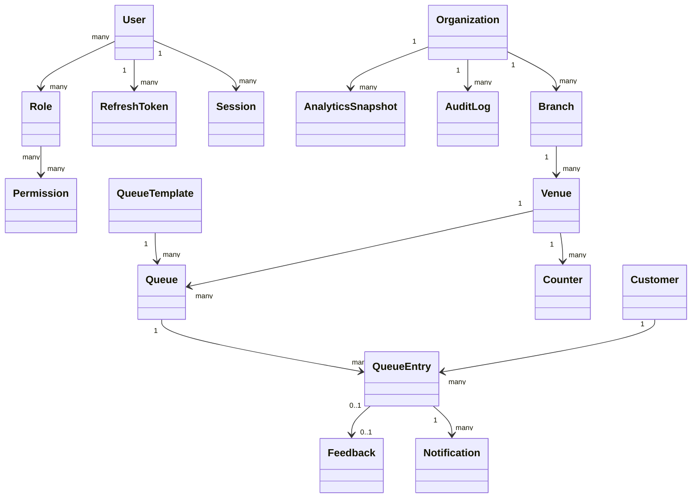
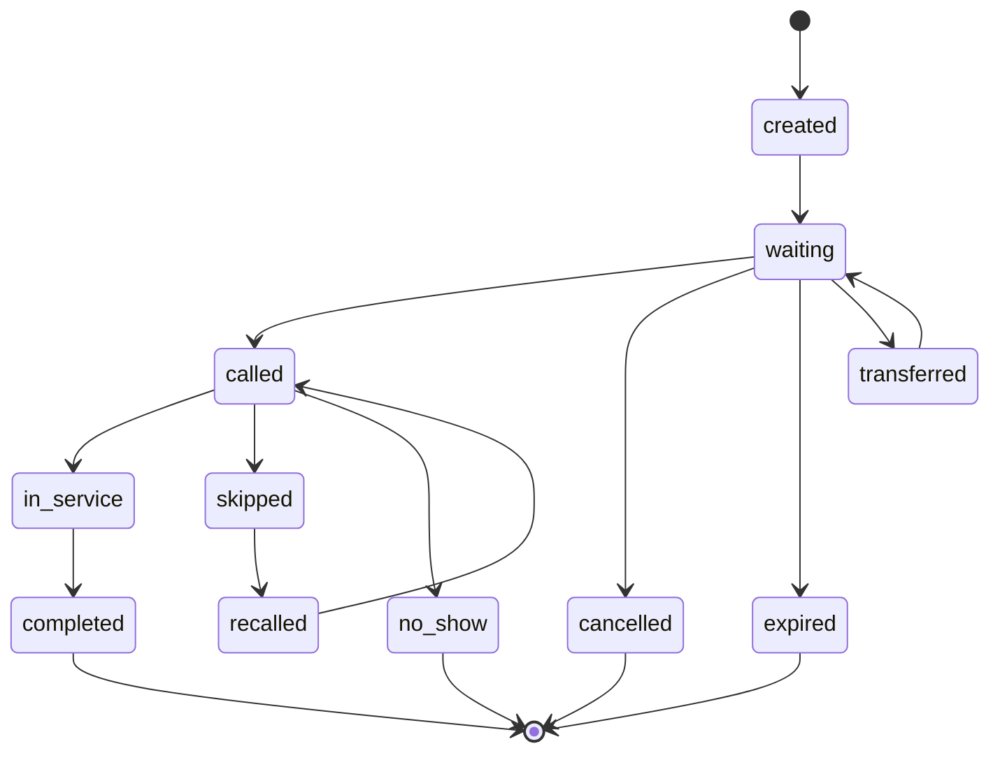

# Domain Model

> Phase 3 scope: database architecture and backend data design only. This document intentionally contains no Express routes, controllers, services, middleware, Mongoose schema code, TypeScript interfaces, React code, or API endpoint definitions. Phase 3 adapts the approved QueueIt requirements to the requested MERN persistence architecture, with MongoDB as the durable system of record and Redis as a non-authoritative cache/coordination layer.

## Aggregate Overview

## Entity Catalogue

| Entity | Purpose | Business Responsibility | Relationships | Ownership | Lifecycle | Aggregate Root | Business Rules | Expected Growth | Future Expansion |
| --- | --- | --- | --- | --- | --- | --- | --- | --- | --- |
| `organizations` | Tenant boundary | Own policies, branding, isolation, billing scope | Branches, users, roles, settings | Platform | trial/active/suspended/deleted | Yes | Cannot hard-delete operational history | Low/medium | Billing, SSO, data residency |
| `branches` | Location boundary | Timezone, address, operating hours | Organization -> venues | Organization | draft/active/suspended/deleted | Within Organization | Must inherit tenant isolation | Medium | Regional hierarchy |
| `venues` | Service area | Capacity and queue operating context | Branch -> counters/queues | Branch | active/paused/closed/deleted | Within Branch | Belongs to one branch | Medium/high | Maps, kiosks |
| `counters` | Service point | Operator assignment and serving state | Venue, employees, queue entries | Venue | active/busy/paused/closed | Within Venue | Only one active service at a counter | Medium | Hardware devices |
| `queues` | Live waiting line | Capacity, status, schedule, token sequence | Venue, template, entries | Venue | draft/open/paused/closed/archived | Yes | Atomic order and token changes | High | Priority lanes |
| `queueTemplates` | Reusable queue configuration | Default policies/schedules | Organization/venue -> queues | Organization | draft/active/retired | Yes | Template changes do not rewrite history | Medium | Industry presets |
| `queueEntries` | Customer queue participation | Position, token, lifecycle, timing | Queue, customer, counter, employee | Queue | waiting/called/in_service/completed/etc. | Within Queue | No duplicate tokens per reset scope | Very high | Appointments, payments |
| `customers` | Service recipient profile | Contact and preference profile | Queue entries, feedback | Organization/global policy | active/merged/anonymized | Yes | PII minimization | High | Mobile identities |
| `employees` | Staff profile | Tenant employment and assignments | User, branches, venues, counters | Organization | active/inactive/terminated | Within Organization | Cannot operate unauthorized venue | High | Scheduling/payroll |
| `users` | Authenticated identity | Credentials, MFA, roles | Roles, sessions, tokens | Platform/Organization | pending/active/locked/deleted | Yes | Email uniqueness strategy | High | SSO/passkeys |
| `roles` | Named authorization bundle | Permission grouping and scope | Permissions, users | Organization/platform | active/retired | Yes | System roles immutable | Medium | ABAC conditions |
| `permissions` | Fine-grained capabilities | Authorization vocabulary | Roles | Platform | active/deprecated | Yes | Stable machine keys | Low | API scopes |
| `sessions` | Login session metadata | Revocation and device tracking | User, refresh tokens | User | active/revoked/expired | Within User | Revocable independently | Very high | Device trust |
| `refreshTokens` | Rotating credential record | Secure token renewal | Session/user | User | active/rotated/revoked/expired | Within Session | Store only hashes | Very high | Token families |
| `notifications` | Delivery record | In-app/email/SMS/push status | Queue entry/customer/user | Organization | pending/sent/failed/expired | Yes | Async retry, TTL where safe | Very high | Templates/providers |
| `auditLogs` | Immutable event trail | Compliance and investigation | Actor/resource/tenant | Organization/platform | append-only/archive | Yes | Never updated by app flows | Very high | SIEM export |
| `feedback` | Customer satisfaction | Ratings and comments | Queue entry/customer/venue | Organization | submitted/moderated/anonymized | Yes | One feedback per completed entry | High | NPS, surveys |
| `analyticsSnapshots` | Precomputed metrics | Dashboard/report speed | Org/branch/venue/queue | Organization | open/final/archive | Yes | Derived and rebuildable | High | Revenue forecasts |
| `featureFlags` | Controlled rollout | Enable features by scope | Org/branch/user segment | Platform | draft/enabled/disabled | Yes | Deterministic evaluation | Medium | Experiments |
| `systemSettings` | Global/tenant configuration | Platform and tenant defaults | Org optional | Platform/Organization | active/versioned | Yes | Validate before activation | Low | Policy marketplace |

## Queue Lifecycle

