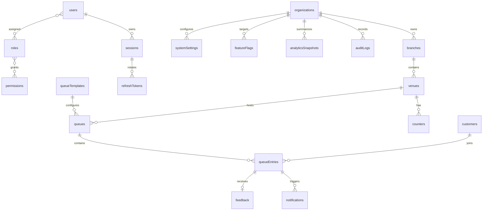

# ER Diagram

> Phase 3 scope: database architecture and backend data design only. This document intentionally contains no Express routes, controllers, services, middleware, Mongoose schema code, TypeScript interfaces, React code, or API endpoint definitions. Phase 3 adapts the approved QueueIt requirements to the requested MERN persistence architecture, with MongoDB as the durable system of record and Redis as a non-authoritative cache/coordination layer.
# ER Diagram

> Phase 3 scope: database architecture and backend data design only. This document intentionally contains no Express routes, controllers, services, middleware, Mongoose schema code, TypeScript interfaces, React code, or API endpoint definitions. Phase 3 adapts the approved QueueIt requirements to the requested MERN persistence architecture, with MongoDB as the durable system of record and Redis as a non-authoritative cache/coordination layer.

